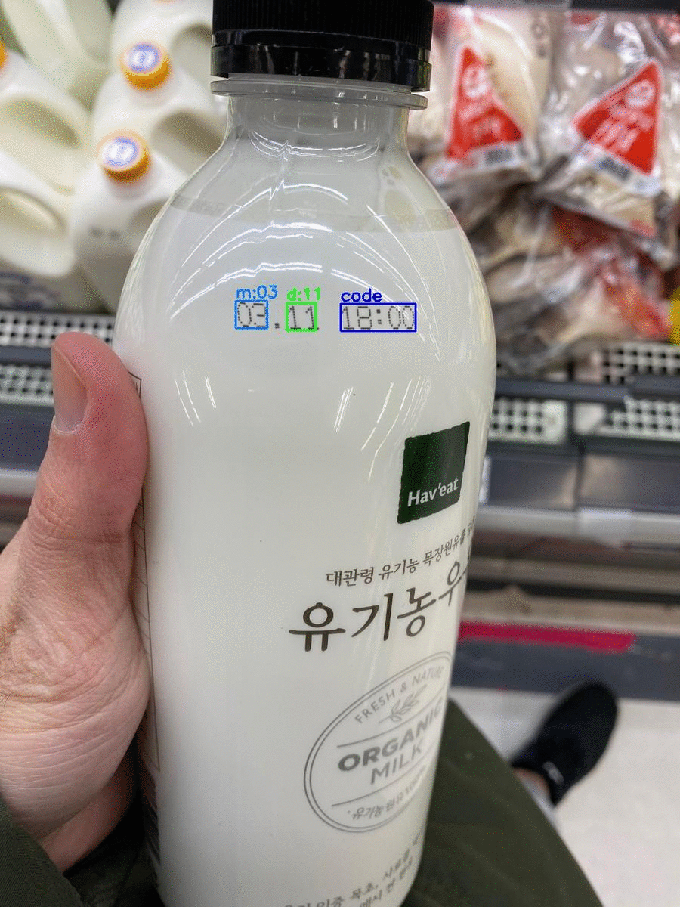
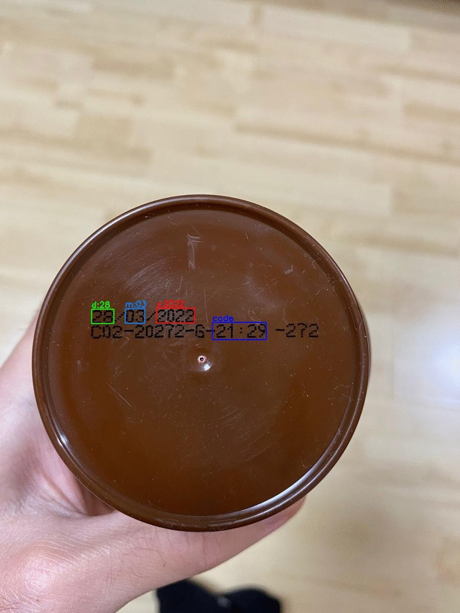
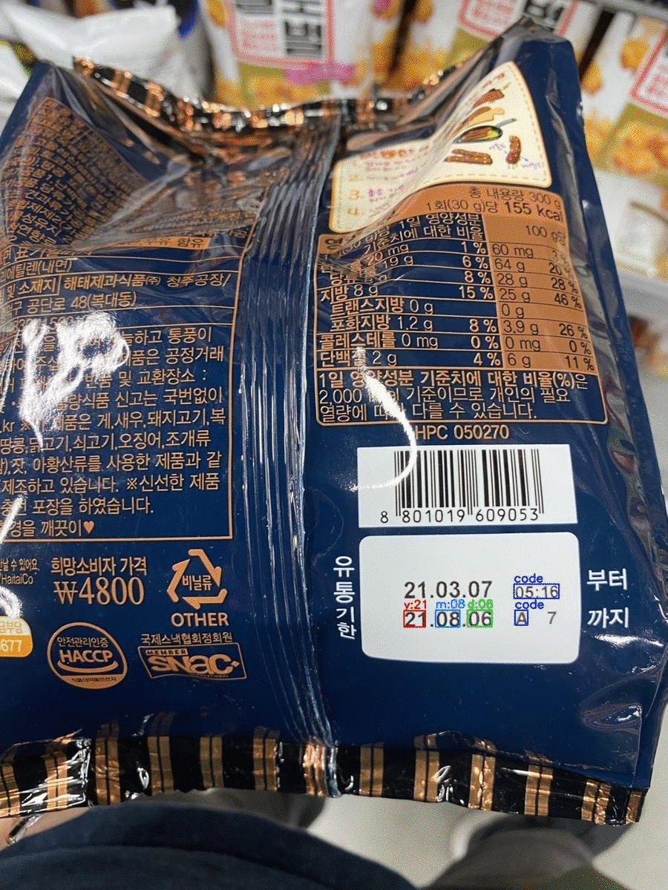

# A Generalized Framework for Recognition of Expiration Date on Product Packages Using Fully Convolutional Networks

**[Paper](https://drive.google.com/file/d/1wTaXGbmXy-fAuInhfUk04ZQ-rZZGfKSV/view?usp=sharing)
\-
[Exe](https://drive.google.com/drive/folders/1ch6pOgzInlGOOo3OHyMNJ-OUiHLSF623?usp=sharing)
\- [Dataset](https://drive.google.com/file/d/1Thq5xMPey9xcV-hg9QnPVbfqFYVCo-ix/view?usp=sharing)**

## Introduction
This project proposes a generalized framework for recognizing and
understanding the expiration date of product packages. The proposed
framework can handle challenging expiration date cases and distinguish
13 different date formats. Moreover, it can accurately detect and
recognize expiration dates even when the input image contains multiple
dates. It generates bounding boxes with predictions in the image.

<figure>
    

          
    

    <figcaption style="text-align: center; font-size: 16px;"><strong>Figure 1: </strong> Qualitative results of the expiration date recognition and understanding.</figcaption>
</figure>

## Executable files
We've released **[executable files](https://drive.google.com/drive/folders/1ch6pOgzInlGOOo3OHyMNJ-OUiHLSF623?usp=sharing) of the proposed framework. Anyone
who would like to test their own images for recognition and
understanding the expiration date can use our **[executable file](https://drive.google.com/drive/folders/1ch6pOgzInlGOOo3OHyMNJ-OUiHLSF623?usp=sharing). 

## Dataset
In the lack of a publicly available dataset, we create a novel dataset,
ExpDate, consisting of 1767 real-world images with expiration dates. It
is now publicly available for further research.  

## Details
Please check this **[website](https://felizang.github.io/expdate/)** for
more details about executable files and dataset.

## Citation
If you find this dataset useful for your research, please cite:

    @inproceedings{seker2021understanding,
      title={A Generalized Framework for Recognition of Expiration Date on Product Packages Using Fully Convolutional Networks},
      author={Seker, Ahmet Cagatay and Ahn, Sang Chul},
      booktitle={-},
      pages={-},
      year={2021}
    }

