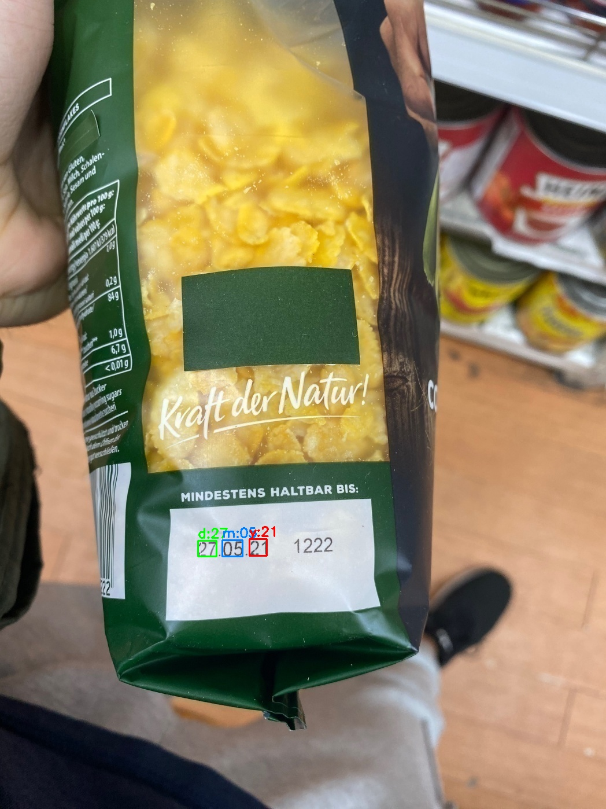
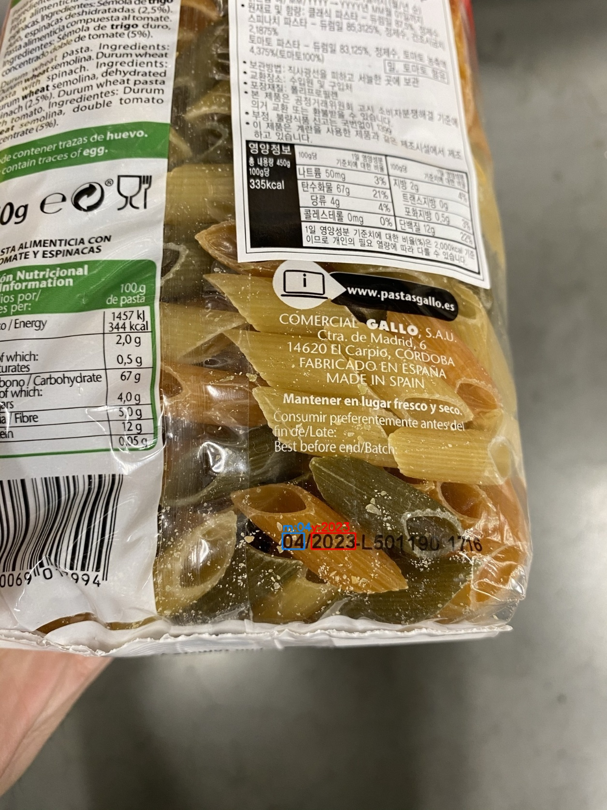

# A Generalized Framework for Recognition of Expiration Date on Product Packages Using Fully Convolutional Networks

**[Paper](https://drive.google.com/file/d/1wTaXGbmXy-fAuInhfUk04ZQ-rZZGfKSV/view?usp=sharing)
\-
[Demo](https://drive.google.com/drive/folders/1ch6pOgzInlGOOo3OHyMNJ-OUiHLSF623?usp=sharing)
\- [Dataset](https://felizang.github.io/expdate/)**

## Introduction
This project proposes a generalized framework for recognizing and
understanding the expiration date of the products. The proposed
framework can handle challenging expiration date cases and distinguish
13 different date formats. Moreover, it can accurately detect and
recognize expiration dates even when the input image contains multiple
dates. It generates bounding boxes with predictions in the image.

<figure>
    

      
    

    <figcaption style="text-align: center; font-size: 16px;"><strong>Figure 1: </strong> Qualitative results of the expiration date recognition and understanding.</figcaption>
</figure>

## Demo
We've released a demo of the proposed framework as an exe file. Anyone
who would like to test their own images for recognition and
understanding the expiration date can use our demo file. We've produced
two separate demo files for Windows (supports only CPU) and Ubuntu
(supports CPU & GPU). To run the demo, make sure that you place the
`images` folder and the `demo.exe` file in the same folder. After
running the code, it will save the predictions in the result folder. We
also provide a webcam demo version in which you can use your camera for
recognizing and understanding the expiration date in real-time.

## Dataset
In the lack of publicly available dataset, we create a novel dataset,
ExpDate, consisting of 1767 real-world images with expiration dates. It
is now publicly available for further research.

## Citation
If you find this dataset useful for your research, please cite:

    @inproceedings{seker2021understanding,
      title={A Generalized Framework for Recognition of Expiration Date on Product Packages Using Fully Convolutional Networks},
      author={Seker, Ahmet Cagatay and Ahn, Sang Chul},
      booktitle={-},
      pages={-},
      year={2021}
    }

